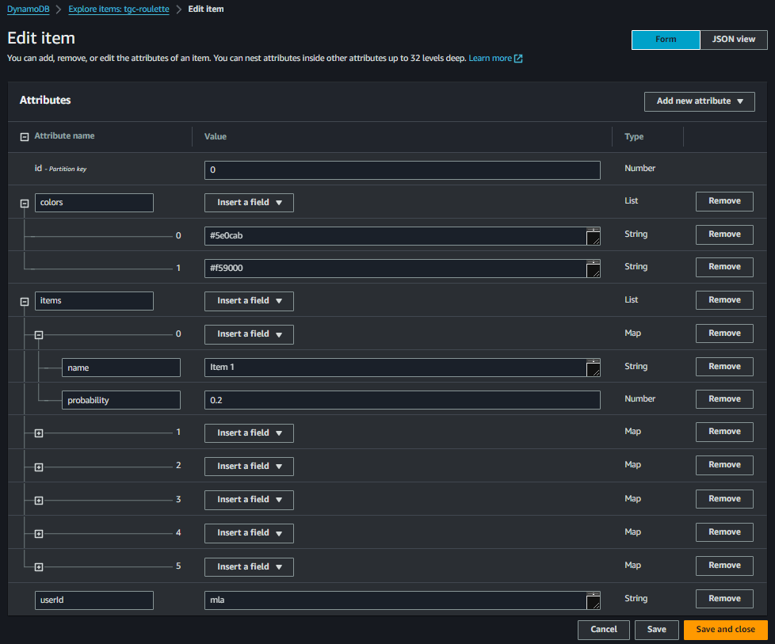

# Result


## Roulette config is saved in a DynamoDB table



## Lambda which retrieves the configuration

```
import { DynamoDBClient, QueryCommand } from "@aws-sdk/client-dynamodb";
import { unmarshall } from "@aws-sdk/util-dynamodb";

const client = new DynamoDBClient({});

export const handler = async (event) => {
    const { userId } = event.queryStringParameters;

    const command = new QueryCommand({
        TableName: 'tgc-roulette',
        IndexName: 'userId-index',
        KeyConditionExpression: 'userId = :userId',
        ExpressionAttributeValues: {
            ':userId': { S: userId }
        },
        Limit: 1 // Ensure only one item is returned
    });

    try {
        const response = await client.send(command);

        if (response.Items.length > 0) {
            return {
                statusCode: 200,
                headers: {
                    "Access-Control-Allow-Origin": "*",
                },
                body: unmarshall(response.Items[0]),
            };
        } else {
            return {
                statusCode: 404,
                headers: {
                    "Access-Control-Allow-Origin": "*",
                },
                body: JSON.stringify({ message: 'Item not found' }),
            };
        }
    } catch (error) {
        return {
            statusCode: 500,
            headers: {
                "Access-Control-Allow-Origin": "*",
            },
            body: JSON.stringify(userId),
        };
    }
};
```
